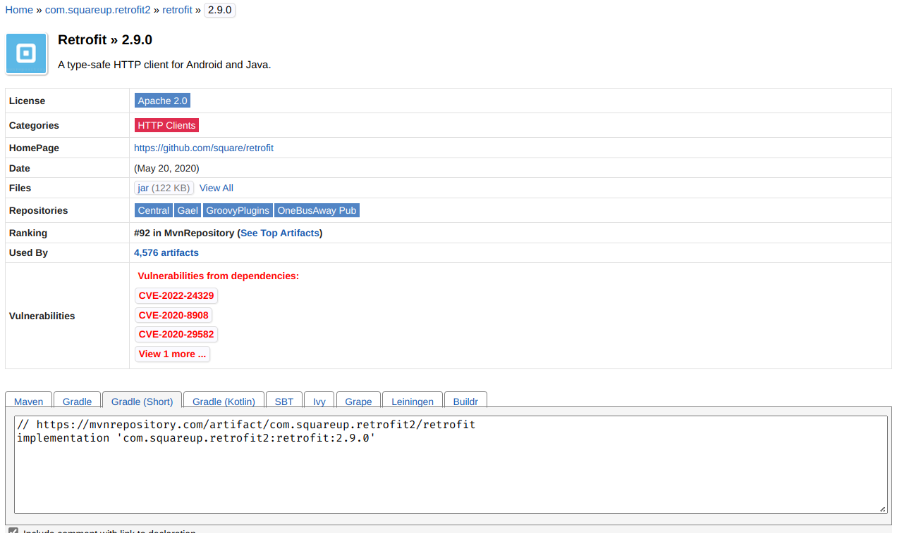
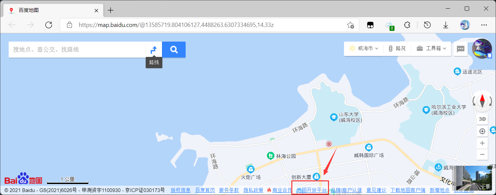
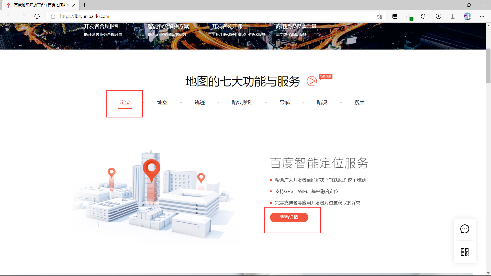
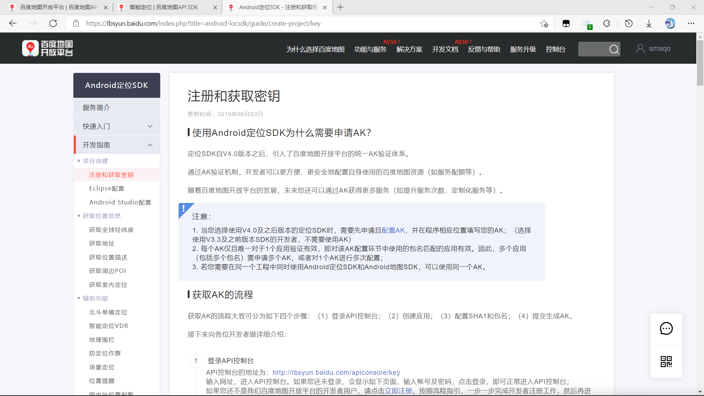
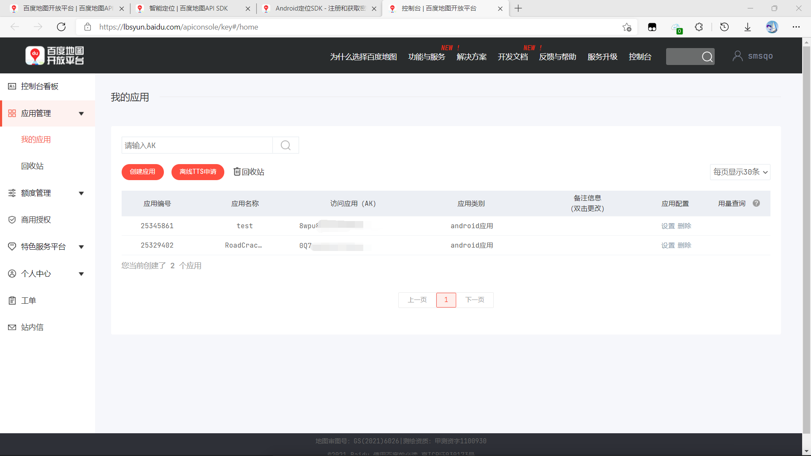
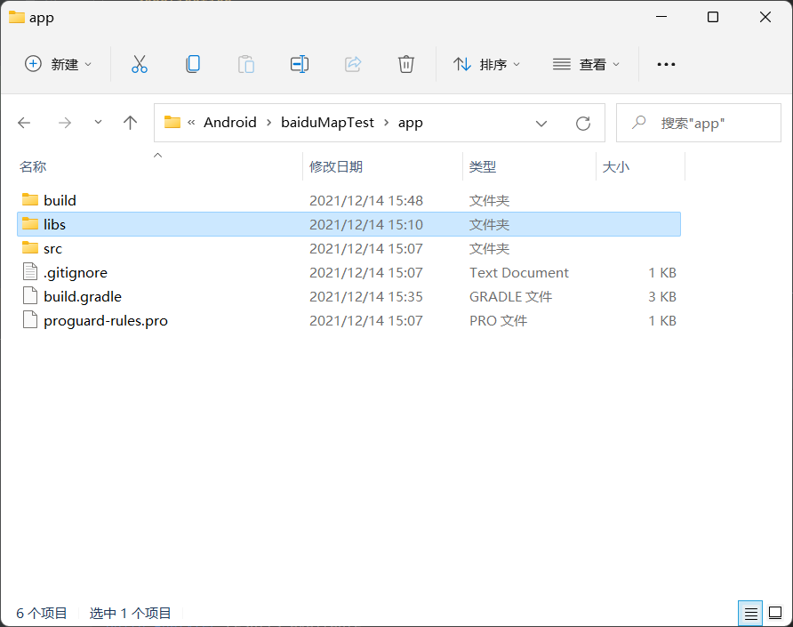
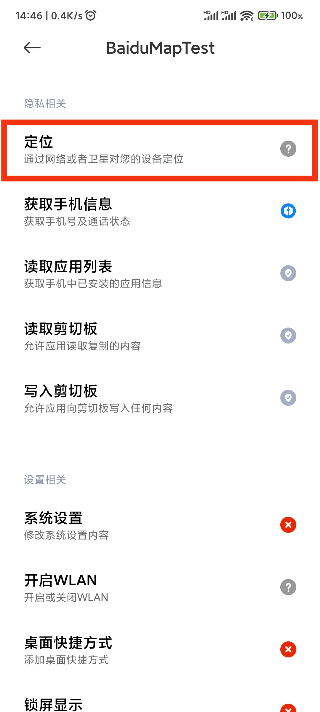

# Android编程概览


## 1. Android概要

Android 是用于移动设备的操作系统。被用于智能手机,平板电脑,智能手表等一系列设备。
大多数手机运行Android，使其成为最流行的移动操作系统。

Android系统是基于Linux的内核进行修改的, 当前的稳定版本是 Android 12，于 2021年10月4日发布。截至2022年5月，Android 11 是使用最多的版本。

Android生态中, 有关操作系统的部分是开源的, 可以随意修改使用; 而Google全家桶(GMail, GooglePlay, GoogleMap等)服务也是Android生态的一部分, 却是闭源的. 在国内, "Android"特指前一部分.

> Android更多是作为终端出现, 相比于网页前端仅多了些操作移动硬件的方法, 因此开发的重点与网页前端是非常类似的(重点在"界面更新"和"网络交互"上). 开发时请一定注意这一点, 不要将过多的业务处理逻辑放在AndroidAPP上. 

> 基于上一点, 国内纯原生的AndroidAPP不多, 而是内嵌网页浏览器显示页面. 

> Android相关的知识相对杂乱, 需要做好长期学习的准备.


## 2. 编程语言, 项目管理工具, IDE

### 编程语言: Java, Kotlin, Dart, Groovy

#### Java和Kotlin (经常使用)

> 2019年的Google I/O大会上, Google 官方正式宣布，Kotlin 编程语言现在是 Android 应用程序开发人员的首选语言。Java 占据 Android 开发绝对统治的时代一去不复返了。

> Android最开始的编程语言是Java. 但因为一些利益问题, Google和Java的东家Oracle打起了官司. 为了避免不利结果对自己产生影响, Google与Jetbrains合作, 将Kotlin扶为Android的首选开发语言. 

Kotlin是由JetBrains开发的针对JVM、Android和浏览器的静态编程语言，目前，在Apache组织的许可下已经开源。Kotlin是多功能的, 除了Android开发, 它也可用于服务端, 网页前端的开发; 此外也有Kotlin Native项目, 可将Kotlin用于原生(底层)开发. 最近Kotlin还在尝试移动设备多平台, 很快Kotlin也可以用于IOS开发中了. 

Kotlin与Java有良好的交互性, 这意味着你可以在项目中同时使用Kotlin和Java编程. Kotlin从其他语言中汲取了大量经验, 这让它解决了Java编程中的大量痛点; 同时它的协程机制能够很好地描述异步机制, 非常适合在前端开发中使用. 基于这些原因, 越来越多的Android组件开始使用Kotlin重写, 甚至有些组件或功能优先或只提供对Kotlin的支持.

> 开发Android必须要有Java的基础. 一方面, 想要读懂Android的老项目需要Java知识; 另一方面, 网上大多数的Kotlin教程是默认读者有Java的基础的. 因此, 即使是准备开发新项目, 也建议在Java的基础上学习Kotlin, 再使用Kotlin进一步开发. 

#### Dart

Dart是Flutter框架下使用的一门语言, 该框架是Google早期开源的应用开发框架, 可以跨平台(Android+IOS)开发. 该语言只用于Flutter. 

#### Groovy (偶尔使用)

此语言被誉为"JVM平台上的脚本语言", 是Gradle工具的一部分. Gradle马上就会介绍到. 


### 项目管理工具: Gradle

假如没有IDE, 则项目就只是一堆有层级关系的源码和素材文件. 我们应该如何管理项目, 如下载/管理项目依赖、构建/测试项目、管理项目版本、以及项目的打包和推送? 

上述就是项目管理工具的功能. 安装工具后, 编写工具能读懂的配置文件/脚本, 并按照规范组织目录结构, 就可以通过几个命令自动执行上述工作啦.

Java界目前最流行的项目管理工具是maven和gradle. 由于更加灵活, Google选用gradle作为Android的项目管理工具. 

> Gradle灵活的代价是学习成本非常高, 而且版本经常更新. 有些时候为了下载一些依赖就必须借助科学上网的手段...

> 工具不用自己下载, 因为你如果使用下面的IDE, 每次创建项目都会自动帮你配置gradle工具. 


#### IDE: Android Studio

> 这是Google和Jetbrains合作推出的IDE, 官方唯一钦定! 
> 下载链接: https://developer.android.google.cn/studio/

开发AndroidAPP就离不开它的. 包括了代码编辑,界面设计,项目审阅,性能评测,Android模拟器等全方面的功能. 用它是肯定对的. 


> [注意] 内存消耗非常大. 8G内存勉强带动, 16G刚好.


## 3. Android项目的开发过程 (概要)

1. [创建项目] 在Android Studio中创建一个新的项目. 创建后, gradle脚本将自动执行, 用以下载项目所需要的依赖包. 
2. [添加依赖] 在项目中的`*.gradle`脚本中添加, 然后点击同步按钮即可.
3. [设计界面] IDE中可以通过拖拽的方式设计界面, 实际上是修改项目中关于界面的XML文件. 也可以在项目中添加图片等附件并引用. 
4. [设计逻辑] 即编写代码. IDE可以自动识别出界面中的控件, 并在编写逻辑代码时给出引用这些控件的提示.
5. [测试运行] 点击运行按钮后, IDE将调用Gradle, 将代码中的Kotlin/Java代码分两步编译为Dalvik字节码(`*.dex`). 最后将代码和所有附件打包成APK, 复制到手机(或虚拟机)上安装并运行. 
6. [打包发布] 测试运行时的APK都是测试版; 正式发布时, 需要经过个人密钥签名后再打包; 而后再从各手机厂商的应用商城中发布APK.


## 4. Android项目的基本结构

可参考此图, 截自Android Studio.

> 这个目录结构是"Android视图"下的. 


1. `manifests/AndroidManifest.xml`: 是APP的配置. 在这里你可以为APP添加界面概要, 为APP申请权限等(联网,存储访问等). 一些第三方SDK的配置也需要写在这里. 
2. `java/`: 这个目录下编写逻辑代码, 是开发人员主要操作的的地方. Java/Kotlin的代码都放在这里.
3. `res/`: 放置各种资源. 不但图片视频等被当做资源, 如颜色,字符串,主题,界面等都是资源. 它们在XML文件中被定义, 可在代码中引用.
4. `Gradle Script/build.gradle`: Gradle配置文件. 任何与项目开发相关的配置, 如Android版本,项目用到的依赖包,JDK版本,编译选项等等, 都是在这里配置的.


## 5. Android的四大组件

> Activity, Service, BroadcastReceiver, ContentProvider. 这四个组件是Android架构中相对重要的类.

Activity: 一个单独的屏幕(窗口). 在AndroidStudio中, 创建Activity就是创建一个界面XML文件和一个Java类, 在这个类的源码中编写界面逻辑.

Service: 在后台完成用户指定的操作, 如后台播放音乐,下载文件等. 创建后在Java源码中编写相关逻辑. 

ContentProvider: 实现数据共享, 可以让一个应用程序的指定数据及提供给其他应用程序. 源码中可以获取或存入数据. 

BroadCastReceiver: 类似于"中断": 接收感兴趣的外部事件(如电话呼入,网络可用), 并作出响应(比如发出一个通知). 


## 6. 常用依赖

> 这些依赖都是针对**开发**的, 不是针对**业务**的. 

#### 有关网络通信: Retrofit

Retrofit是一个RESTful的HTTP网络请求框架的封装. AndroidAPP需要经常和服务器交互实现功能(就像网页前端那样), 因此网络通信是一个非常重要且庞大的话题. 为了使用此依赖(框架), 你需要首先将依赖添加到项目中.

> 如何寻找依赖包? 一般来讲过程是这样的:
>
> 1. 打听到一个依赖包的名字, 如retrofit.
>
> 2. 从网络仓库中找到这个依赖的"链接". Gradle复用了Maven的在线仓库, 因此你可以在[这里](https://mvnrepository.com/)搜索"retrofit". 选择依赖名和版本后, 在选项卡里选择"Gradle (short)", 如下图所示: 
>
>    
>
>    复制下方输入框中的内容. 这一行是gradle的脚本.
>
> 3. 回到项目中, 打开`app`目录下的`build.gradle`文件, 将脚本粘贴在`depencencies`闭包中. AS检测到脚本发生变化后会在编辑器右上角显示同步图标, 点击它就可以下载依赖到本地了. 

Retrofit只是一个封装, 你需要将它和其他依赖配合才可以真正发起网络通信. 其他依赖包括: 

- OkHttp: 网络通信的实际操作者.
- GSON/Moshi/FastJson: 对象转换. 将通信得到的字符流(通常是JSON形式)转化成Java对象, 方便直接在Java/Kotlin代码中使用. GSON和FastJson比较常用; Moshi能更好发挥Kotlin的一些语法优势.
- RxJava/Kotlin-Coroutine: 异步支持. 若没有异步, 如网络通信和页面刷新是同步进行的, 则界面会一直freeze直到服务器返回数据. RxJava学习曲线很陡; Kotlin-Coroutine基本是Kotlin自带的, 上手相对简单. 

> 查询依赖时, 如果有`Retrofit`版本的, 就选择它.

如何使用? 以Retrofit+OKHTTP+Moshi+Kotlin-Coroutine为例(实例语言: Kotlin)

1. 创建一个Retrofit对象. Retrofit对象描述了一台服务器和与服务器交互使用的各类组件. 之后所有的网络请求都是通过此对象创建的. 

   ```kotlin
   package com.roadcrack.net.meta
   
   import com.roadcrack.BuildConfig
   import com.roadcrack.util.MoshiUtil
   import okhttp3.Cookie
   import okhttp3.CookieJar
   import okhttp3.HttpUrl
   import okhttp3.OkHttpClient
   import retrofit2.Retrofit
   import retrofit2.converter.moshi.MoshiConverterFactory
   import retrofit2.converter.scalars.ScalarsConverterFactory
   
   object MyRetrofit {
   
       // 使用Gradle中的配置. 在 build.gradle(app)的 android.buildTypes.{debug, release} 中定义.
       private const val HOST_ID = BuildConfig.SERVER_URL
   
       private val retrofit: Retrofit = run {
           
           // 使用此配置, 让retrofit可以使用存储cookie
           val cookieJar = object : CookieJar {
               private val cookieStore = mutableMapOf<String, List<Cookie>>()
   
               override fun saveFromResponse(httpUrl: HttpUrl, list: List<Cookie>) {
                   cookieStore[httpUrl.host()] = list
               }
   
               override fun loadForRequest(httpUrl: HttpUrl): List<Cookie> =
                   cookieStore[httpUrl.host()] ?: listOf()
           }
   
           // 使用此配置, 使用OkHttp作为通信组件
           val client = OkHttpClient.Builder()
               .cookieJar(cookieJar).build()
   
           Retrofit.Builder()
               .baseUrl("http://$HOST_ID/")
               .client(client)
               .addConverterFactory(ScalarsConverterFactory.create())			// 先使用ScalarsConverter做对象转换 (前面没有提到)
               .addConverterFactory(MoshiConverterFactory.create(MoshiUtil))	// 如果Scalars不行, 再用Moshi转换器
               .build()
       }
   
       // 可以在调用这个对象(MyRetrofit)的时候指定一个类(下详), 调用retrofit.create()方法, 产生一个通信的接口. 
       internal inline operator fun <reified T> invoke(): T = retrofit.create(T::class.java)
   }
   ```

   这一步创建了个名为`MyRetrofit`的对象. 

   为了与后端通信, 需要创建一些接口. 这些接口用类来表示. 如下:

   ```kotlin
   package com.roadcrack.net
   
   import com.roadcrack.net.meta.MyRetrofit
   import com.roadcrack.plain.WebResult
   import okhttp3.RequestBody
   import retrofit2.http.*
   
   // 创建的是接口. 
   interface RoadService {
   
       @POST("/road/id") // 注解. 指定了方法和访问的URL
       suspend fun fetchRoadId( // 方法前添加了suspend关键字, 指明是通过kotlin-coroutine(协程)实现异步的. 
           @Query("districtCode") districtCode: Long, // 这两个是访问接口时需要的参数. 注解中为网络接口中的参数名称.
           @Query("roadName") roadName: String
       ): WebResult<Long> // WebResult<Long> 是调用此接口的返回值类型. 如果使用RxJava等其他异步组件, 则返回值可能有更多要求. 
   }
   ```

   这个类描述了一个接口, 每一个方法对应一个接口. 使用接口是这样的: 

   ```kotlin
   val srv = MyRetrofit<RoadService>()
   val result: WebResult<Long> = srv.fetchRoadId(371002L, "青岛路") // 这里有异步
   // 对result做进一步操作.
   ```


#### 有关界面

关于界面的依赖很多很杂, 这里谨举几个常用组件作为例子, 抛砖引玉. 

1. AutoLayout 屏幕适配

   Android本身的Layout(页面布局)中的宽高属性只支持match(紧贴父组件),wrap(紧贴子组件),以及常量大小. 不过在android阵营中，存在着各式各样的尺寸和分辨率的机型. 这个组件可以根据按照比例定义一个组件相对于其父组件的比例大小. 

   > 引入: compile 'com.zhy:autolayout:1.4.5'

2. Banner 轮播图

   引入此依赖, 就可以方便地将轮播图添加到界面中. 

   > 引入: implementation ‘com.youth.banner:banner:1.4.10’

3. Picasso: 图片加载库

   比起Android自带的图片显示, Picasso更加灵活, 如可以自动设置图片宽高像素的大小, 以及根据界面变化情况实时调整. 其背后有调度器和缓存, 让加载图片的体验更加顺畅. 

   > 引入: compile 'com.squareup.picasso:picasso:2.5.2'


#### 其他

还有一些组件可以很好地提高开发质量或开发体验, 这里也列举几个. 

1. Hilt 依赖注入

   这是Google官方推出的依赖注入库, 可以减少在项目中执行手动依赖注入的样板代码. 它是对另一个库Dagger的封装. 如果你用过Java后端的Spring框架, 就应该了解依赖注入的重要性; 同时也会对Hilt的用法感到熟悉, 因为它也是通过注解来实现注入的. 

   比如, 你可以在`Activity`类上添加注解

   ```kotlin
   @AndroidEntryPoint
   class ExampleActivity : AppCompatActivity() {
   
     @Inject lateinit var analytics: AnalyticsAdapter
     ...
   }
   ```

   这样一个`AnalyticsAdapter`的类就会被自动注入给`analytics`(如果能找到的话), 而不需要在代码中手动赋值. 当项目变复杂时, Hilt将会让项目更加抑郁调试并降低耦合度.

   > 引入: classpath 'com.google.dagger:hilt-android-gradle-plugin:2.28-alpha'

2. ButterKnife 界面组件绑定

   为了找到XML文件中定义的界面组件, 或者为组件添加事件监听器, 需要在Java/Kotlin代码中编写很多样板代码; 而ButterKnife可以通过类似`@BindView`这样的注解减轻这种麻烦. 

   > 引入: implementation 'com.jakewharton:butterknife:8.8.0'


## 7. 官方组件: Material Design & Android Jetpack

#### Material Design

Material Design是由Google的设计工程师们基于传统优秀的设计原则，结合丰富的创意和科学技术所开发的一套全新的界面设计语言，包含了视觉、运动、互动效果等特性。一般在创建项目的时候自带. 这个库中包含了大量的开箱即用且视觉效果优秀的组件, 可以直接在界面的XML文件中添加. 

比如, 如果希望往主界面中添加一个侧边栏, 就可以这样写:

```xml
<androidx.drawerlayout.widget.DrawerLayout
        xmlns:android="http://schemas.android.com/apk/res/android"
        xmlns:app="http://schemas.android.com/apk/res-auto"
        android:id="@+id/drawerLayout"
        android:layout_width="match_parent"
        android:layout_height="match_parent">
    
    <FrameLayout
            android:layout_width="match_parent"
            android:layout_height="match_parent">
        
    <androidx.appcompat.widget.Toolbar
            android:id="@+id/toolbar"
            android:layout_width="match_parent"
            android:layout_height="?attr/actionBarSize"
            android:background="@color/colorPrimary"
            android:theme="@style/ThemeOverlay.AppCompat.Dark.ActionBar"
            app:popupTheme="@style/ThemeOverlay.AppCompat.Light" />
    </FrameLayout>
    
    <TextView
        android:layout_width="match_parent"
        android:layout_height="match_parent"
        android:layout_gravity="start"
        android:background="#FFF"
        android:text="This is menu"
        android:textSize="30sp" />
</androidx.drawerlayout.widget.DrawerLayout>
```

最外层使用了`DrawerLayout`元素, 就可以让该元素内的内容呈现抽屉抽拉的效果. 内层元素写明了布局中的组件细节(如抽屉中包含了一段"This is menu"的文本). MaterialDesign中的其他组件(如菜单栏,悬浮按钮,卡片布局等)也是同理, 可以参考文末提到的参考书进行学习. 


#### Android Jetpack

Jetpack 是一个由多个库组成的套件，可帮助开发者遵循最佳做法、减少样板代码并编写可在各种 Android 版本和设备中一致运行的代码，让开发者可将精力集中于真正重要的编码工作。

Jetpack是一个大话题, Google仍在此项目中活跃, 因此非常值得一学. 它包括了很多加速开发者编写代码的组件和工具, 以及架构的指导. 它主要包括了四个方面: 架构, UI, 行为和底层库. 

> 如同Java写多了的人才能知道Kotlin的优势, Jetpack也只适合那些已经在Android中挣扎了一段时间的开发者(#笑). Jetpack中的一些概念, 如生命周期,编译时语句检查, 只有有一定经验的开发者才能看出它的优势. 这个框架放在这里只是为了强调它的重要性, 当你的开发水平到了一定阶段的时候一定不要忘记回头学一学这个框架. 

具体地, 它包括:

1. 生命周期机制(Lifecycle-aware observers and observable): 用于"关注点分离". Android中的每一个Activity,每一个组件都有生命周期, 该概念会让APP更节省资源(如息屏时, 某些组件将从活跃转为休眠). 该机制提供的观察者模式可以让你更好地根据生命周期的时机, 决定是否执行某些代码. 和Kotlin的协程结合会有奇效. 
2. Room: AndroidAPP可以操控一个前端的轻量数据库: Sqlite3. 原生的操作方法可能会带来一些复杂性和不安全. Room框架通过注解化简了开发过程, 简化了代码, 并将检查SQL语句的时机从运行时提早到编译期, 从而能够更早地发现代码中的错误, 保证APP的健壮性. 
3. Databinding: 默认启用. 不需要在代码中手动绑定XML布局文件中的组件, 而是在项目编译打包的时候自动生成一些绑定类. 开发时只需要调用类中的成员即可. 原理和ButterKnife不同, 但功能是相似的.
4. ViewModel: Google希望开发者利用该组件将项目组织为MVVM架构, 这样可以让APP的架构更加富有层次易于修改和阅读. 

> 有些第三方组件是中途被收录入Jetpack中的, 如Hilt. 


## 8. 第三方服务

一些大厂提供自己服务的Android版本SDK, 如百度和高德提供地图支持, 网易提供即时通信支持等等. 

一般来讲, 在Android中使用第三方服务需要以下步骤: 

1. 登录大厂的开发者平台, 注册账号, 进入个人工作台创建应用; 
2. 下载第三方服务的Android SDK, 将其置于项目目录范围内; 
3. 配置`build.gradle`, 让项目能够发现并使用该SDK; 
4. 配置`Manifest.xml`, 添加服务并提供服务的AK(Access Key, 从平台注册中得到); 有时还需要修改APP权限. 
5. 在代码中使用SDK. 

笔者曾在使用百度地图SDK时写过文档, 将其附在本文后以供参考. 


## 9. 其他与展望

1. Java也可以用, 但Kotlin是历史趋势, 快学学看吧.
2. Android原生开发越来越少, 大多是用原生先写一个架子, 主体部分内嵌网页显示(这样前端就可以只写一次代码就运行在网页,小程序,Android多个平台上了). 不建议跳进安卓原生界面美化的大坑里. 
3. 和Java一样, Android也可以通过JNI可以和原生库(主要指动态链接库, \*.so文件)交互. 这主要用在音视频处理方面.
4. Flutter(Dart)可以很好地跨平台开发(Android+IOS). 但从个人角度来说...这个框架不太容易上手, 慎入.
5. 2021年Jetpack推出了Compose组件, 抛弃了XML直接用Kotlin写界面, 是对界面编写的一次尝试. 虽然目前仍不是很稳定, 但使用人数有快速增长的迹象. 
6. 推荐的资源: 郭霖的《第一行代码(第三版)》, 是最佳的Android入门教材, 包括了上面说到的绝大多数方面. 可以选择50¥淘宝支持作者, 或者上Z-Library上找PDF资源(科学上网). 


----


# 百度地图API: 如何开启定位功能

> 项目使用百度地图API, 主要是为了实现项目中的两部分功能: 
>
> 1. 定位: 获取当前用户所在的 城市->区县->街道. 
> 2. 地图展示: 将已经拍照的图片以定位点的形式展现在地图上 
>
> 网上的材料大多是2017年之前的, 好多都过时了. 有必要写个新文档了. 


### 1. 准备工作 - 项目之外

首先要在百度的开发者平台上申请AK(Access Key). 打开百度地图, 你可以在这里找到为开发者提供的网站:



进入后, 在"定位"一栏中点击查看详情, 拉到最后找到`Android定位SDK`的选项, 选择后便可以进入百度API定位相关的开发文档. 在文档中"开发指南->项目创建->注册和获取密钥"一栏中包括了注册和获取密钥(AK)的方法. 跟着这里的指南走就可以. 如果是团队开发的话, 建议以团队的名义创建一个新的百度账号再申请. 

> 百度开放平台: https://lbsyun.baidu.com/
> 百度地图Android定位SDK: https://lbsyun.baidu.com/index.php?title=android-locsdk





> 如何获取开发版/发布版的SHA-1? 
>
> 1. (推荐) https://www.jianshu.com/p/f424ae12ddde
> 2. https://blog.csdn.net/qq_29269233/article/details/53725865


注册并申请好后, 你应该可以在自己的`百度地图开放平台控制台看板`中看到申请到的应用编号和AK: 




### 2. 准备工作 - 项目配置

指南中对项目中如何配置写的很模糊, 有些地方对不上, 如目前百度地图提供的是`aar`格式的扩展, 但指南中没有写. 因此这里只看此文档即可. 

1. 从平台上下载百度地图所必要包: 访问这里: [SDK下载 - 百度LBS开放平台 (baidu.com)](https://lbs.baidu.com/index.php?title=sdk/download&action#selected=mapsdk_basicmap,mapsdk_searchfunction,mapsdk_lbscloudsearch,mapsdk_calculationtool,mapsdk_radar), 在开发包格式部分选择"AAR"格式. 

2. 将下载好的包放置到项目`app/libs`目录下: 

   

3. 添加依赖配置到`settings.gradle`. 在该文件的`repository`下添加: 

   ```groovy
   flatDir { dirs "libs" }
   ```

   这一步的目的, 是让gradle可以将`libs`目录下的文件也当做*可以*引入的依赖. 这样项目才能看到你刚才添加的`aar`文件. 添加后, 你的`settings.gradle`可能看上去是这样的: 

   ```groovy
   dependencyResolutionManagement {
       repositoriesMode.set(RepositoriesMode.FAIL_ON_PROJECT_REPOS)
       repositories {
           google()
           mavenCentral()
           flatDir {
               dirs 'libs'
           }
       }
   }
   rootProject.name = "BaiduMapTest"
   include ':app'
   ```

4. 添加配置到`app`子项目的`build.gradle`中. 刚才只是让`gradle`可以看到我们添加的`aar`文件, 但想把它引入到项目中, 还需要我们另外配置. 因为这个配置只和`app`子项目有关, 所以要注意这里提到的`build.gradle`是子项目的, 不是项目的. 

   1. 添加Android配置: 在`android`闭包下添加`sourceSet`: 

      ```groovy
      android {
          // ... 其他配置
          sourceSets {
      	    main {
          	    jniLibs.srcDirs = ['libs']
      	    }
          }
      }
      ```

      > 这块儿为什么要写"jniLibs"我也不是很清楚. 猜测是因为百度地图的AAR中带了一些JNI(Java Native Interface)的东西, 所以必须要指定下位置. 

   2. 添加依赖: 这个你应该熟悉了, 在`dependencies`闭包下添加就可以了: 

      ```groovy
      dependencies {
          implementation files("libs/BaiduLBS_AndroidSDK_Lib.aar") // 以文件形式将百度地图的AAR引入到项目中. 
          // ...其他依赖
      }
      ```

   这一步结束后, 尝试在AndroidStudio中同步gradle配置(快捷键: `ctrl`+`O`). 如果配置成功了, 则代码中用到有关百度地图的类和对象时, 应该就会有高亮提醒了. 

### 3. 代码编写和解释

1. 在`AndroidManifest.xml`中添加相关配置: 

   - 在`<manifest/>`中添加以下权限申请: 

     ```xml
     <manifest>
         <!-- 这个权限用于进行网络定位-->
         <uses-permission android:name="android.permission.ACCESS_COARSE_LOCATION"/>
         <!-- 这个权限用于访问GPS定位-->
         <uses-permission android:name="android.permission.ACCESS_FINE_LOCATION"/>
         <!-- 用于访问wifi网络信息，wifi信息会用于进行网络定位-->
         <uses-permission android:name="android.permission.ACCESS_WIFI_STATE"/>
         <!-- 获取运营商信息，用于支持提供运营商信息相关的接口-->
         <uses-permission android:name="android.permission.ACCESS_NETWORK_STATE"/>
         <!-- 这个权限用于获取wifi的获取权限，wifi信息会用来进行网络定位-->
         <uses-permission android:name="android.permission.CHANGE_WIFI_STATE"/>
         <!-- 写入扩展存储，向扩展卡写入数据，用于写入离线定位数据-->
         <uses-permission android:name="android.permission.WRITE_EXTERNAL_STORAGE"/>
         <!-- 访问网络，网络定位需要上网 -->
         <uses-permission android:name="android.permission.INTERNET"/>
         <!-- 允许挂载和反挂载文件系统可移动存储 -->
         <uses-permission android:name="android.permission.MOUNT_UNMOUNT_FILESYSTEMS"/>
         <!-- 允许程序读取底层系统日志文件 -->
         <uses-permission android:name="android.permission.READ_LOGS"/>
         <!-- 允许访问振动设备 -->
         <uses-permission android:name="android.permission.VIBRATE"/>
         <!-- 允许使用PowerManager的 WakeLocks保持进程在休眠时从屏幕消失 -->
         <uses-permission android:name="android.permission.WAKE_LOCK"/>
         <!-- 允许程序读取或写入系统设置 -->
         <uses-permission android:name="android.permission.WRITE_SETTINGS"/>
         <!-- android 9.0上使用前台服务，需要添加权限 -->
         <uses-permission android:name="android.permission.FOREGROUND_SERVICE" />
         <!-- 用于读取手机当前的状态 -->
         <uses-permission android:name="android.permission.READ_PHONE_STATE" />
         <!-- 读取缓存数据 -->
         <uses-permission android:name="android.permission.READ_EXTERNAL_STORAGE" />
         <!-- 获取模拟定位信息 -->
         <uses-permission android:name="android.permission.ACCESS_MOCK_LOCATION"/>
         
         <!-- ...其他配置... -->
     </manifest>
     ```

   - 在`<application/>`元素下添加百度地图的service. 没有这个service, 是无法使用百度地图的功能的. 

     ```xml
     <application>
         <!-- 声明service组件 -->
         <service
             android:name="com.baidu.location.f"
             android:enabled="true"
             android:process=":remote"/>
     
         <!-- AK鉴权 -->
         <meta-data
             android:name="com.baidu.lbsapi.API_KEY"
             android:value="你的AK需要填在这里" />
         <!-- http://lbsyun.baidu.com/apiconsole/key -->
     </application>
     ```

2. 一个小demo, 测试效果. 下面是我写的一个小demo. 你可以将下面的demo做一些修改后放到你的项目中, 测试看看上面的配置是否已经完备. 

   - 添加文件`LocationService.kt`: 

     ```kotlin
     package com.example.test
     
     import android.annotation.SuppressLint
     import android.content.Context
     import com.baidu.location.BDAbstractLocationListener
     import com.baidu.location.BDLocation
     import com.baidu.location.LocationClient
     import com.baidu.location.LocationClientOption
     import java.util.concurrent.locks.ReentrantLock
     import kotlin.concurrent.withLock
     
     class LocationService(
         context: Context
     ) {
     
         init {
             lock.withLock {
                 client = LocationClient(context)
                 client.locOption = defaultOption
             }
         }
     
         // Add listener
         operator fun plusAssign(listener: BDAbstractLocationListener) {
             client.registerLocationListener(listener)
         }
     
         inline operator fun plusAssign(crossinline blk: (BDLocation) -> Unit) {
             this += object : BDAbstractLocationListener() {
                 override fun onReceiveLocation(loc: BDLocation) {
                     blk(loc)
                 }
             }
         }
     
         // delete listener
         operator fun minusAssign(listener: BDAbstractLocationListener) {
             client.unRegisterLocationListener(listener)
         }
     
         fun start() = lock.withLock { client.start() }
         fun stop() = lock.withLock { client.stop() }
         fun requestLocation() = lock.withLock { client.requestLocation() }
         fun isStarted() = client.isStarted
         fun requestHotStopState(): Boolean = client.requestHotSpotState()
     
     
         val sdkVersion: String
             get() = client.version
     
         companion object {
             @SuppressLint("StaticFieldLeak")
             private lateinit var client: LocationClient
     
             private val defaultOption = LocationClientOption().apply {
                 locationMode =
                     LocationClientOption.LocationMode.Hight_Accuracy // 可选，默认高精度，设置定位模式，高精度，低功耗，仅设备
                 setCoorType("bd09ll") // 可选，默认gcj02，设置返回的定位结果坐标系，如果配合百度地图使用，建议设置为bd09ll;
                 setScanSpan(3000) // 可选，默认0，即仅定位一次，设置发起连续定位请求的间隔需要大于等于1000ms才是有效的
                 setIsNeedAddress(true) // 可选，设置是否需要地址信息，默认不需要
                 setIsNeedLocationDescribe(true) // 可选，设置是否需要地址描述
                 setNeedDeviceDirect(false) // 可选，设置是否需要设备方向结果
                 isLocationNotify = false // 可选，默认false，设置是否当gps有效时按照1S1次频率输出GPS结果
                 setIgnoreKillProcess(true) // 可选，默认true，定位SDK内部是一个SERVICE，并放到了独立进程，设置是否在stop
                 setIsNeedLocationDescribe(true) // 可选，默认false，设置是否需要位置语义化结果，可以在BDLocation
                 setIsNeedLocationPoiList(true) // 可选，默认false，设置是否需要POI结果，可以在BDLocation
                 SetIgnoreCacheException(false) // 可选，默认false，设置是否收集CRASH信息，默认收集
                 isOpenGps = true // 可选，默认false，设置是否开启Gps定位
                 setIsNeedAltitude(false) // 可选，默认false，设置定位时是否需要海拔信息，默认不需要，除基础定位版本都可用
             }
     
             private val lock = ReentrantLock()
         }
     }
     ```

   - 在你的主Activity中, 根据以下代码进行删改: 

     ```kotlin
     class MainActivity : ComponentActivity() {
     
         private lateinit var service: LocationService
         private var enabled = false
     
         override fun onCreate(savedInstanceState: Bundle?) {
             super.onCreate(savedInstanceState)
     		val button: Button = TODO("假设你已经通过某种方式获取了一个Button")
             button.setOnClickListener { view ->
     			(view as Button)
     			enabled = !enabled
     			view.text = if (enabled) "已开启" else "已关闭"
     			if (enabled) serivce.start() else service.stop()
             }
         }
     
         override fun onStart() {
             super.onStart()
             service = LocationService(applicationContext)
             service += object : BDAbstractLocationListener() {
                 override fun onReceiveLocation(loc: BDLocation) {
                     val str = with(loc) {
                         buildString {
                             append("latitude = $latitude\n")
                             append("longitude = $longitude\n")
                             append("radius = $radius\n")
                             append("errorCode = $locType\n")
                             append("addr = $addrStr\n")
                             append("city = $city\n")
                             append("town = $town\n")
                             append("street = $street")
                         }
                     }
                     toast(str)
                 }
             }
         }
     
     
         companion object {
             private fun Context.toast(msg: String) =
                 run { Toast.makeText(this, msg, Toast.LENGTH_SHORT).show() }
         }
     }
     ```

     完成后, 如果你的APP可以实现"点击按钮后, 以3秒/次的频率显示设备所在的位置"的功能, 说明你的配置已经完备了! 你可以再重新回顾下整个配置的过程, 然后继续看看百度的在线文档继续开发了! 

     这里显示的信息如果包括了null, 说明配置有问题; 如果错误码为62(显示的是`errorCode = 62`), 则可能是你的APP没有开启定位权限. 这种情况下你应该查看第三步. 

3. 可能的解决方案...? 

   以小米手机为例, 在这里打开你APP的定位权限; 重启APP, 检查现在null的问题是否已经解决. 

   注意: 每次安装都需要重新打开权限. 

   

   > 错误码为161说明定位成功. 如果你的错误码不是62, 你可以从百度地图的在线文档中查看错误码对应的解释: [android-locsdk | 百度地图API SDK (baidu.com)](https://lbsyun.baidu.com/index.php?title=android-locsdk/guide/addition-func/error-code)
   >
   > 造成这一现象的原因: 你的手机Android版本在M或以上, 需要手动添加申请权限的代码.

4. 230错误及其解决方案: 未完全解决

   出现的情况: 第一次请求可能可以得到正确的结果, 但后面再请求, 就只能得到NULL

   原因: 在前面申请AK的步骤出现问题, 认证失败. 简述百度地图官方给出的解释是, 需要在自己的机器上生成密钥, 并在`<项目名>.app`中的`build.gradle`文件中检查`android.defaultConfig.applicatoinId`, 它是当前项目的ID. 在申请时应该正确填写密钥和项目ID这两个信息. 如果APP运行时能在日志中看到这样一条信息: "I/baidu_location_service: LocationAuthManager Authentication AUTHENTICATE_SUCC", 说明是正确被授权了(如果仍然是返回NULL, 则考虑是否是定位权限没有打开, 或者其他问题). 

   问题是, 每个机器上的密钥不同(对应的, `项目ID`由于是写在项目文件中的, 所以不会有这样的问题), 这会给多人开发造成问题. 显然这个问题不应该通过将同一个密钥分发给所有开发者的方法完美解决, 而是应该让密钥和当前的项目绑定(这样在使用其他项目的时候就不会被当前项目干扰). 

   这可能有两种方法实现. 由于密钥是以文件形式存储的, 所以可能可以: ① 在gradle中设置当前项目使用的密钥; ② 或者, 在`Android Studio`中的`project structure`中配置. 

   > 写文档的时候主要开发者就只有作者, 所以上面只提供解决问题的思路. 希望阅读此文档的人找到解决方案后替换到这里. 


### 4. 商用化和版权

因为现阶段还在开发中, 还没有考虑商用化的问题; 但百度地图的在线开发文档中有关于商用授权的说明. 你可以在`百度地图在线开发文档(链接见参考材料) -> Andorid定位SDK -> 快速入门 -> 服务简介 -> 免费说明`中找到关于商用授权的信息. 

> 点进去一看, 50000元/年. 这也太贵了...


### 5. 参考材料

1. 百度地图在线开发文档: [Android定位SDK | 百度地图API SDK (baidu.com)](https://lbsyun.baidu.com/index.php?title=android-locsdk)

2. 百度官方的小DEMO. 进入页面后选择`DEMO下载`: [Android定位SDK - 产品下载 | 百度地图API SDK (baidu.com)](https://lbsyun.baidu.com/index.php?title=android-locsdk/geosdk-android-download)

   

# IOS开发技术

#### 第三方库

- UI related

  - SnapKit
    - [github地址](https://github.com/SnapKit/SnapKit)
    - Swift的自动布局DSL
  - MGSwipeTableCell

    - [github地址](https://github.com/MortimerGoro/MGSwipeTableCell)
    - 用于实现侧滑按钮
  - SVProgressHUD/MBProgressHUD

    - github地址：[SVProgressHUD](https://github.com/SVProgressHUD/SVProgressHUD)/[MBProgressHUD](https://github.com/matej/MBProgressHUD)
    - 加载提示框
  - iCarousel
    - [github地址](https://github.com/nicklockwood/iCarousel)
    - 实现轮播效果
  - RAMAnimatedTabBarController 
    - [github地址](https://github.com/Ramotion/animated-tab-bar)
    - Swift语言，为tabbar添加动画
  - JSQMessagesViewController
    - [github地址](https://github.com/jessesquires/JSQMessagesViewController)
    - iOS消息类UI库
  - Charts
    - [github地址](https://github.com/danielgindi/Charts)
    - 图表库
  - PNChart
    - [github地址](https://github.com/kevinzhow/PNChart)
    - 图表库
  - pop
    - [github地址](https://github.com/facebookarchive/pop)
    - 动画引擎，用于动画过渡
  - UITableView-FDTemplateLayoutCell
    - [github地址](https://github.com/forkingdog/UITableView-FDTemplateLayoutCell)
    - 自动计算表格行高

- Utility related
  - MagicalRecord

    - [github地址](https://github.com/magicalpanda/MagicalRecord)
    - 简化CoreData操作的工具库，用于数据存储和持久化
  - SwiftyJSON

    - [github地址](https://github.com/SwiftyJSON/SwiftyJSON)
    - 用于处理JSON数据的Swift库
  - KeychainAccess

    - [github地址](https://github.com/kishikawakatsumi/KeychainAccess)
    - 简单的Keychain封装
  - YYKit
    - [github地址](https://github.com/ibireme/YYKit)
    - iOS组件合集，包含JSON模型、缓存、图像、异步图像加载、富文本、键盘监听管理等框架/工具库
  - FLEX
    - [github地址](https://github.com/FLEXTool/FLEX)
    - 调试库

- Network  related

  - AFNetworking
    - [github地址](https://github.com/AFNetworking/AFNetworking)
    - Objective-C的网络库
  - Alamofire
    - [github地址](https://github.com/Alamofire/Alamofire)
    - Swift 语言的 HTTP 网络开发工具包
  - Moya
    - [github地址](https://github.com/Moya/Moya)
    - Swift网络抽象层
  - SDWebImage
    - [github地址](https://github.com/SDWebImage/SDWebImage)
    - 用于下载并缓存网络图片


#### 框架

- 基本框架
  - Foundation

    - 用于访问基本数据类型，集合和操作系统服务，为应用程序定义功能的基础层
  - UIKit

    - 提供创建基于触摸用户界面的类，提供了在屏幕上绘制的机制，捕获事件，和创建通用用户界面元素，也通过管理显示在屏幕上的组件来组织复杂的项目
  - Core Data

    - 提供对象的管理，管理应用程序数据模型
  - Core Graphics

    - 创建复杂的图形
  - Core Animation

    - 创建高级的动画和虚拟效果
  - Accelerate

    - 包含加速数学和DSP函数
  - AddressBook
    - 包含直接访问用户联系人数据库的函数
  - AddressBookUI
    - 包含显示系统定义的联系人挑选界面和编辑界面的类
  - AssetsLibrary
    - 包含显示用户照片和视频的类
  - AudioToolbox
    - 包含处理音频流数据以及播放或录制音频的接口
  - AVFoundation
    - 包含播放或录制音频的Objective-C接口
  - AudioUnit
    - 包含加载并使用音频单元的接口
  - CFNetwork
    - 包含通过WiFi或者蜂窝无线访问网络的接口
  - CoreAudio
    - 声明其他Core Audio接口使用的数据类型和常量
  - CoreFoundation
    - 提供一些基本软件服务，包括常见数据类型抽象、字符串实用工具、群体类型实用工具、资源管理以及偏好设置
  - CoreLocation
    - 包含确定用户方位信息的接口
  - CoreText
    - 包含一个文本的布局渲染引擎
  - EventKit
    - 包含访问用户日历事件数据的接口
  - EventKitUI
    - 包含显示标准系统日历界面的类
  - ImageIO
    - 包含读取或写入图像数据的类
  - IOKit
    - 包含设备所使用的接口
  - MapKit
    - 包含将地图界面嵌入到应用程序的类，也可以用于查找地理编码反向坐标
  - OpenAL
    - 包含OpenAL接口。OpenAL是一个跨平台的方位音频库
  - Security
    - 包含管理证书、公钥私钥以及信任策略的接口
  - SystemConfiguration
    - 包含用于处理设备网络配置的接口
  - SwiftUI
    - 基于Swift建立的声明式UI框架

- 第三方框架

  - ReactiveCocoa

    - [github地址](https://github.com/ReactiveCocoa/ReactiveCocoa)
    - 基于响应式编程思想的Objective-C的实践，Cocoa是苹果整套框架的简称

  - Masonry

    - [github地址](https://github.com/SnapKit/Masonry)
    - Objective-C的自动布局框架

  - MJExtension

    - [github地址](https://github.com/CoderMJLee/MJExtension)
    - 用于Model和JSON之间互相转换的框架

  - MJRefresh

    - [github地址](https://github.com/CoderMJLee/MJRefresh)
    - 用于添加上拉加载、下拉刷新效果

  - DZNEmptyDataSet

    - [github地址](https://github.com/dzenbot/DZNEmptyDataSet)
    - 用于在空白页面上显示提示信息

  - ChameleonFramework

    - [github地址](https://github.com/vicc/chameleon)
    - 支持Swift和Objective-C的颜色框架

  - WebViewJavascriptBridge

    - [github地址](https://github.com/marcuswestin/WebViewJavascriptBridge)
    - 用于原生与H5交互

  - fmdb

    - [github地址](https://github.com/ccgus/fmdb)

    - 用OC语言封装了SQLite API的数据库框架

  - CocoaLumberjack

    - [github地址](https://github.com/CocoaLumberjack/CocoaLumberjack)
    - 日志框架


# 微信小程序开发技术

- #### 编程语言

  - WXML + WXSS +基于JS的逻辑层
  - 基本类似网页签单 HTML5+CSS+JavaScript 的编程方式，细节上稍有不同

- #### 官方文档

  - https://developers.weixin.qq.com/miniprogram/dev/framework/

- #### 微信小程序开发者工具

  - 在官网注册页选择小程序注册即可，账号分为个人版和企业版
  - 下载微信开发者工具
    - 第一步，请前往**https://mp.weixin.qq.com/debug/wxadoc/dev/devtools/download.html**微信开发者工具下载页面根据自己的操作系统下载对应的安装包进行安装。
    - 第二步，打开微信开发者工具，选择新建小程序项目。
    - 编程

- #### 开发框架

  - [wepy](https://github.com/wepyjs/wepy)  组件化开发框架
  - [Labrador](https://github.com/maichong/labrador)  模块化开发框架

- #### 常用第三方库

  - 前端UI库
    - [weilanwl/*ColorUI*](https://github.com/weilanwl/ColorUI)
    - [youzan/vant-weapp](https://github.com/youzan/vant-weapp)
    - [umicro/uView](https://github.com/umicro/uView)
    - [TaleLin/lin-*ui*](https://github.com/TaleLin/lin-ui)
    - [TalkingData/iview-weapp](https://github.com/TalkingData/iview-weapp)
    - [wux-weapp/wux-weapp](https://github.com/wux-weapp/wux-weapp)
    - [weui-wxss](https://github.com/weui/weui-wxss)
    - [Wa-UI](https://github.com/liujians/Wa-UI) 
    - [wxapp](https://github.com/youzouzou/wxapp)
    -  
  - 其他
    - HTML,MD渲染 [sbfkcel/towxml](https://github.com/sbfkcel/towxml)
    - MD渲染 [TooBug/wemark](https://github.com/TooBug/wemark)
    - 小游戏 [Data-Camp/WeApp_Demos](https://github.com/Data-Camp/WeApp_Demos)
    - 异步开发 [youngjuning/wx-promise-pro](https://github.com/youngjuning/wx-promise-pro)
    - 2d 动画 [bobiscool/wxDraw](https://github.com/bobiscool/wxDraw)
  
- 前人总结，包括上述内容和其他补充，Demo案例，强力推荐 ：https://github.com/opendigg/awesome-github-wechat-weapp

# 网页前端技术

- #### 开发框架

  - #### Vue.js

    - 是一套用于构建用户界面的渐进式JavaScript框架。 与其它大型框架不同的是，Vue 被设计为可以自底向上逐层应用。Vue 的核心库只关注视图层，不仅易于上手，还便于与第三方库或既有项目整合
    - 目前使用最多的是vue2和vue3，版本更新是趋势，建议直接尝试vue3。网络上的一些代码和库基于vue2，不兼容vue3，学习者使用过程中需要自己注意
    - 特点是：易用，灵活，性能优秀
    - 编程语言：HTML+JS+CSS
    - 常用组件库：
      - [ElemeFE/mint-*ui*](https://github.com/ElemeFE/mint-ui)
      - [youzan/vant](https://github.com/youzan/vant)
      - [vuejs/*ui*](https://github.com/vuejs/ui)
      - [element-plus/element-plus](https://github.com/element-plus/element-plus)
      - [vueComponent/ant-design-*vue*](https://github.com/vueComponent/ant-design-vue)
      - [didi/cube-*ui*](https://github.com/didi/cube-ui)
      - [TuSimple/naive-*ui*](https://github.com/TuSimple/naive-ui)
      - [vuetifyjs/*vuetify*](https://github.com/vuetifyjs/vuetify)
      - [apache/incubator-weex-*ui*](https://github.com/apache/incubator-weex-ui)
      - [museui/muse-*ui*](https://github.com/museui/muse-ui)
      - ...
      - 

  - #### React

    - Facebook团队开发的前端框架，也是目前最流行的几个前端框架之一
    - 声明式设计
    - 组件化: 构建管理自身状态的封装组件，然后对其组合以构成复杂的 UI。
    - 高效：React通过对DOM的模拟，最大限度地减少与DOM的交互，支持创建虚拟DOM来提高页面性能。
    - 基于JSX语法（JavaScript Xml），JSX是React的核心组成部分，它使用xml标记的方式去直接声明界面，和html、js混写
    - 常用UI库
      - [ant-design/ant-design](https://github.com/ant-design/ant-design)
      - [shoutem/*ui*](https://github.com/shoutem/ui)
      - [Semantic-Org/Semantic-*UI*-*React*](https://github.com/Semantic-Org/Semantic-UI-React)
      - [mui/material-*ui*](https://github.com/mui/material-ui)
      - [chakra-ui/chakra-*ui*](https://github.com/chakra-ui/chakra-ui)
      - ...
      - 

  - #### Angular

    - AngularJS诞生于2009年，是一款构建用户界面的前端框架，后为Google所收购。 它是一个应用设计框架与开发平台，用于创建高效、复杂、精致的单页面应用，通过新的属性和表达式扩展了 HTML，实现一套框架，多种平台，移动端和桌面端。
    - AngularJS有着诸多特性，最为核心的是：MVVM、模块化、自动化双向数据绑定、语义化标签、依赖注入等等。
    - Angular是AngularJS的重写，Angular2以后官方命名为Angular，2.0以前版本称为AngularJS
    - 常用UI库
      - [primefaces/primeng](https://github.com/primefaces/primeng)
      - [NG-ZORRO/ng-zorro-antd](https://github.com/NG-ZORRO/ng-zorro-antd)
      - [Tinkoff/taiga-*ui*](https://github.com/Tinkoff/taiga-ui)
      - [vmware/*clarity*](https://github.com/vmware/clarity)
      - ....

  - #### Bootstrap

    - Bootstrap 是一个用于快速开发 Web 应用程序和网站的前端框架，基于 HTML、CSS、JS。

    - 特点：

      - 移动设备优先：自 Bootstrap 3 起，框架包含了贯穿于整个库的移动设备优先的样式。
      - 浏览器支持：所有的主流浏览器都支持 Bootstrap。
      - 移动设备优先：自 Bootstrap 3 起，框架包含了贯穿于整个库的移动设备优先的样式。

    - 常用UI库

      - [mdbootstrap/mdb-*ui*-kit](https://github.com/mdbootstrap/mdb-ui-kit)

      - [Pixelkit/PixelKit-*Bootstrap*-*UI*-Kits](https://github.com/Pixelkit/PixelKit-Bootstrap-UI-Kits)

      - [xiaoymin/swagger-*bootstrap*-*ui*](https://github.com/xiaoymin/swagger-bootstrap-ui)

      - [reactstrap/reactstrap](https://github.com/reactstrap/reactstrap)

      - [mdbootstrap/material-design-for-*bootstrap*](https://github.com/mdbootstrap/material-design-for-bootstrap)

      - [designmodo/Flat-*UI*](https://github.com/designmodo/Flat-UI)

      - ...

        

  - #### Zepto

    - Zepto是一个轻量级的、针对现代高级浏览器的JavaScript工具库，它兼容jQuery的API。Zepto是一款开源软件，它采用的是对开发者和商业都很友好的开源协议--MIT license。
    - 提供与jQuery兼容的API，但并不是100%覆盖jQuery API；提供一个5-10k的通用库、下载并快速执行、有一套熟悉且稳定的API， 所以可以把主要精力放到应用开发上。
    - 主要的浏览器基本都支持，包括Chrome，Firefox，Safari，IE等
    - 常用UI库
      - [logoove/weui](https://github.com/logoove/weui)
      - [fex-team/GMU](https://github.com/fex-team/GMU)
      - ...

  - #### Foundation

    - Foundation 用于开发响应式的 HTML, CSS and JavaScript 框架，是一个易用、强大而且灵活的框架,用于构建基于任何设备上的 Web 应用。
    - 是一个以移动优先的流行框架。
    - 比起前面的几个框架来说比较小众。

- #### 常用第三方库

  - 大多使用常见的包管理工具，以npm为例，npm平台现有的第三方库基本可以解决开发者的问题。现有的开源库非常多，建议开发者在开发过程中根据需要选择自己使用的第三方库。
  - 常用库
    - [chai](https://www.npmjs.com/package/chai) BDD/TDD assertion library for node.js and the browser. Test framework agnostic.
    - [date-fns](https://www.npmjs.com/package/date-fns) Modern JavaScript date utility library
    - [chokidar](https://www.npmjs.com/package/chokidar) Minimal and efficient cross-platform file watching library
    - [mime](https://www.npmjs.com/package/mime) A comprehensive library for mime-type mapping
    - [jquery](https://www.npmjs.com/package/jquery) JavaScript library for DOM operations
    - [tslib](https://www.npmjs.com/package/tslib) Runtime library for TypeScript helper functions
    - [underscore](https://www.npmjs.com/package/underscore) JavaScript's functional programming helper library.
    - [got](https://www.npmjs.com/package/got) Human-friendly and powerful HTTP request library for Node.js
    - [deepmerge](https://www.npmjs.com/package/deepmerge) A library for deep (recursive) merging of Javascript objects
    - [require-directory](https://www.npmjs.com/package/require-directory) Recursively iterates over specified directory, require()'ing each file, and returning a nested hash structure containing those modules.
    - [es6-promise](https://www.npmjs.com/package/es6-promise) A lightweight library that provides tools for organizing asynchronous code
    - [big.js](https://www.npmjs.com/package/big.js) A small, fast, easy-to-use library for arbitrary-precision decimal arithmetic
    - [bignumber.js](https://www.npmjs.com/package/bignumber.js) A library for arbitrary-precision decimal and non-decimal arithmetic
    - [@testing-library/react](https://www.npmjs.com/package/@testing-library/react) Simple and complete React DOM testing utilities that encourage good testing practices.
    - [@testing-library/jest-dom](https://www.npmjs.com/package/@testing-library/jest-dom) Custom jest matchers to test the state of the DOM
    - [@testing-library/user-event](https://www.npmjs.com/package/@testing-library/user-event) Fire events the same way the user does

# 后端技术

- #### 开发框架

  - #### Django

    - 编程语言：python
    - Django是高水准的Python编程语言驱动的一个开源模型．视图，控制器风格的Web应用程序框架，它起源于开源社区。使用这种架构，程序员可以方便、快捷地创建高品质、易维护、数据库驱动的应用程序。
    - 目前，Django已经成为web开发者的首选框架之一。
    - Django的主要目的是简便、快速的开发数据库驱动的网站。它强调代码复用，多个组件可以很方便的以“插件”形式服务于整个框架，Django有许多功能强大的第三方插件，你甚至可以很方便的开发出自己的工具包。这使得Django具有很强的可扩展性。它还强调快速开发和DRY(Do Not Repeat Yourself)原则。
    - 常用第三方库：大部分可以使用python的包管理工具下载，具体使用说明见各个第三方库的官方文档说明，第三方库非常多，开发者根据需要搜索使用
      - https://pypi.org/project/django-odbc/ django-odbc is a SQL Server DB backend powered by the pyodbc library. pyodbc is a mature, viable way to access SQL Server from Python in multiple platforms and is actively maintained. It's also used by SQLAlchemy for SQL Server connections.
      - https://pypi.org/project/django-mailtrail/ django-mailtrail，A seamless integration that makes Django email awesome.
      - https://pypi.org/project/django-embargoed/ django-embargoed，Django middleware to block visitors from Russia due to the Ukraine invasion
      - https://pypi.org/project/django-address/ django-address，A django application for describing addresses.
      - https://pypi.org/project/django-switch-templatetag/ django-switch-templatetag，Simple switch tag for Django templates.
      - https://pypi.org/project/html2hamlpy/ html2hamlpy，Convert Django-flavored HTML to HamlPy
      - ...

  - #### Flask

    - 编程语言：python
    - Flask是一个使用 Python 编写的轻量级 Web 应用框架。其 WSGI 工具箱采用 Werkzeug ，模板引擎则使用 Jinja2 。Flask使用 BSD 授权。Flask也被称为 “microframework” ，因为它使用简单的核心，用 extension 增加其他功能。Flask没有默认使用的数据库、窗体验证工具。
    - 特点：Flask是一个轻量级的可定制框架，较其他同类型框架更为灵活、轻便、安全且容易上手。它可以很好地结合MVC模式进行开发，开发人员分工合作，小型团队在短时间内就可以完成功能丰富的中小型网站或Web服务的实现。另外，Flask还有很强的定制性，用户可以根据自己的需求来添加相应的功能，在保持核心功能简单的同时实现功能的丰富与扩展，其强大的插件库可以让用户实现个性化的网站定制，开发出功能强大的网站。
    - 常用第三方库：同django一样，这里只是列出一些样例，具体使用请根据需要查找
      - https://pypi.org/project/Flask-SimpleACL/ Flask-SimpleACL，Simple ACL extension
      - https://pypi.org/project/flask-blacklist/ flask-blacklist，Token blacklist flask extension
      - https://pypi.org/project/Flask-Shelve/ Flask-Shelve，Shelve support for Flask
      - ...

  - #### SpringBoot

    - 编程语言：JAVA
    - Spring Boot是由Pivotal团队提供的全新框架，其设计目的是用来简化新Spring应用的初始搭建以及开发过程。该框架使用了特定的方式来进行配置，从而使开发人员不再需要定义样板化的配置。通过这种方式，Spring Boot致力于在蓬勃发展的快速应用开发领域(rapid application development)成为领导者。
    - 相比前两个框架，上手比较困难，多用于大型项目构建。
    - 特点：
      - 可以创建独立的Spring应用程序，并且基于其Maven或Gradle插件，可以创建可执行的JARs和WARs；
      - 内嵌Tomcat或Jetty等Servlet容器；
      - 提供自动配置的“starter”项目对象模型（POMS）以简化Maven配置；
      - 尽可能自动配置Spring容器；
      - 提供准备好的特性，如指标、健康检查和外部化配置；
      - 绝对没有代码生成，不需要XML配置。
    - 常用库：
      - spring-boot-starter-cache/ pring-boot-starter-data-redis 缓存
      - java-jwt 令牌生成
      - hutool-all 常用工具
      - fastjson JSON
      - mybatis-plus-boot-starter 数据库ORM
      - lombok 
      - knife4j-spring-boot-starter 文档
      - xxl-job 定时任务调度
      - ...

  - #### Laravel

    - 编程语言：PHP
    - Laravel是一套简洁、优雅的PHP Web开发框架(PHP Web Framework)。它可以让你从面条一样杂乱的代码中解脱出来；它可以帮你构建一个完美的网络APP，而且每行代码都可以简洁、富于表达力。
    - 常用库
      - 常用composer管理依赖库
      - jwt： tymon/jwt-auth 
      - 跨域： fruitcake/laravel-cors
      - execl操作： maatwebsite/excel
      - 发送短信： overtrue/easy-sms
      - echarts：cyd622/laravel-admin-ext-echarts
      - ...

  - #### CakePHP

    - 编程语言：PHP
    - CakePHP是一个运用了诸如ActiveRecord、Association Data Mapping、Front Controller和MVC等著名设计模式的快速开发框架。该项目主要目标是提供一个可以让各种层次的PHP开发人员快速地开发出健壮的Web应用，而 又不失灵活性。

  - #### Ruby on Rails

    - 编程语言：Ruby
    - Ruby on Rails是一个 Web 应用程序框架,是一个相对较新的 Web 应用程序框架，构建在 Ruby 语言之上。它被宣传为现有企业框架的一个替代。
    - ruby on rails使用的实时映射技术和元编程技术，免去了开发人员在开发过程中编写大量样板文件代码的烦恼。在少数需要使用样板文件代码的时候，开发人员可以通过ruby on rails内建的生成器脚本实时创建，而不再是通过手工编写。rails的这个特点可以使开发人员更专注于系统的逻辑结构，而不必为一些琐碎的细节所烦扰。

  - #### Express

    - Express 是一个保持最小规模的灵活的 Node.js Web 应用程序开发框架，为 Web 和移动应用程序提供一组强大的功能。
    - 常用第三方插件：
      - body-parser：主要是用于解析body中的数据，并将其保存为Request对象的body属性
      - cookie-parser: 主要是解析客户端的cookie数据，并将其保存为Request对象的cookie属性
      - express-session: 解析服务端生成的sessionid对应的session数据，并将其保存为Request对象的session属性。
      - ...